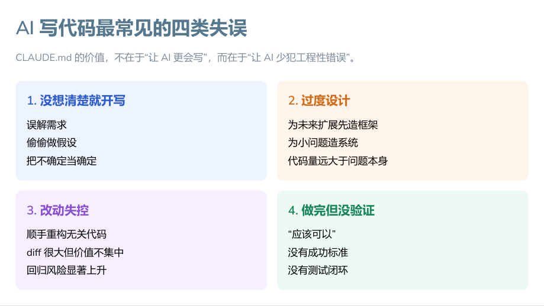
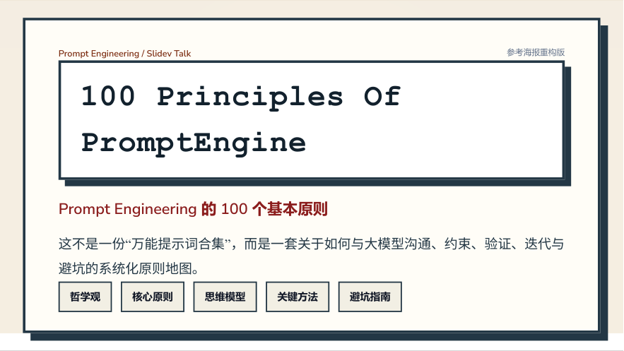
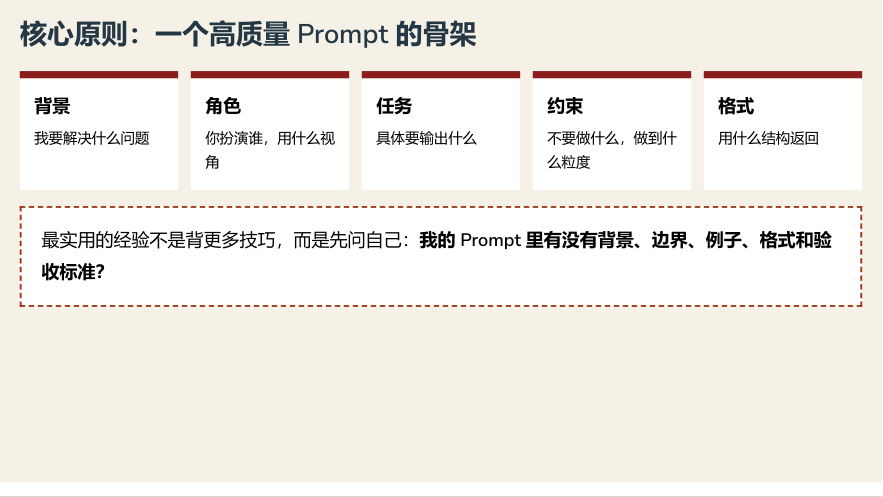

# Principles Of PromptEngine PPT

一个围绕 AI Agent 原则与 Prompt Engineering 原则的 PPT 合集仓库。

这里目前收录两套已经导出的 PDF 成品，适合直接浏览、分享或继续二次修改。

## 项目内容

| 项目 | 说明 | 文件 |
| --- | --- | --- |
| CLAUDE | AI Agent 原则文件讲解 | [CLAUDE-Agent-Principles.pdf](./CLAUDE/CLAUDE-Agent-Principles.pdf) |
| 100 Principles Of PromptEngine | Prompt Engineering 的 100 个基本原则 | [100-Principles-Of-PromptEngine.pdf](./100%20Principles%20Of%20PromptEngine/100-Principles-Of-PromptEngine.pdf) |

## 参考来源

### 1. CLAUDE

- 参考资料：用户提供的本地 `CLAUDE.md`
- 原作者地址：未提供

预览：




### 2. 100 Principles Of PromptEngine

- 参考资料：用户提供的本地参考图 `100个提示词工程原则.jpg`
- 原作者地址：未提供

预览：





## 仓库结构

```text
.
├─ CLAUDE/
│  └─ CLAUDE-Agent-Principles.pdf
├─ 100 Principles Of PromptEngine/
│  └─ 100-Principles-Of-PromptEngine.pdf
└─ assets/
   └─ previews/
```

## 说明

- 当前仓库以导出的 PDF 成品为主。
- 两份内容都基于用户提供的本地参考资料制作。
- 如果后续拿到明确的公开原作者链接，可以继续更新到本 README。
